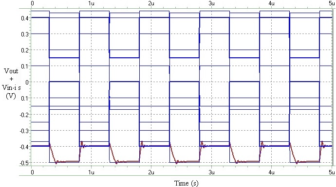

# Neural Network CMOS Circuit as a Weighted Order Statistic Filter

This is a hardware implementation of weighted order statistic (WOS) filter in CMOS 0.35 &#956;m process using a specific recurrent neural network. Weighted order statistic filters can select *k*^th^ largest value of a statistical sample with sample points being repeated based on their weight. Maximum, minimum, and median are special cases in their operation. One of their main applications is in signal processing and specifically in noise removal. 

## Description
The detailed description of the project can be found in our paper: [pdf](./docs/2010-ICEDSA-NN-WOS.pdf) or [IEEE Xplore](https://doi.org/10.1109/ICEDSA.2010.5503078). 
An analog circuit resembling a recurrent neural network is implemented in the project:

  

Each neuron in the first layer is designed to have a sign activation function, for which the circuit diagram is as follows:

  

Thanks to the Kirchhoff's Current Law (KCL), the neuron in the second layer is made only by connecting the outputs of the first layer neurons and a current source (as the bias). As an illustration the results of applying the weighted order statistic filter on a few signals to find their max, min, and median can be seen here:

  

  

  

## The Code
The WOS network is implemented in HSPICE for simulation in CMOS 0.35 &#956;m process. In the time of the original simulations, a TSMC 0.35 &#956;m library file was used. You may use other libraries, probably with some minor alterations. The files include a netlist of the proposed neuron in the project, and a netlist of the filter itself. The configuration in the latter is chosen to showcase the filter working as a median operator, whereas with minor changes (some hinted in the comments in the file) it can be changed to any other weighted order statistic filter, based on the explanations of the [paper](./docs/2010-ICEDSA-NN-WOS.pdf). It performs a range of DC, transient, and corner tests.

# Citation
You may cite the [paper](https://doi.org/10.1109/ICEDSA.2010.5503078) published as a part of this project.

# Contact
I can be reached at hoseini@nevada.unr.edu.
